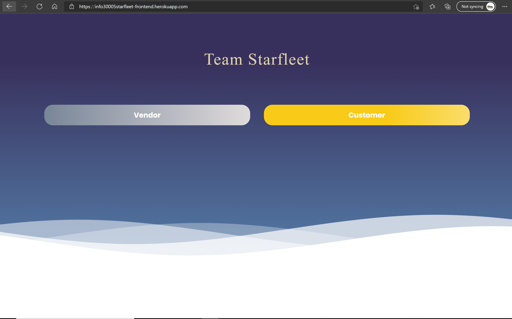
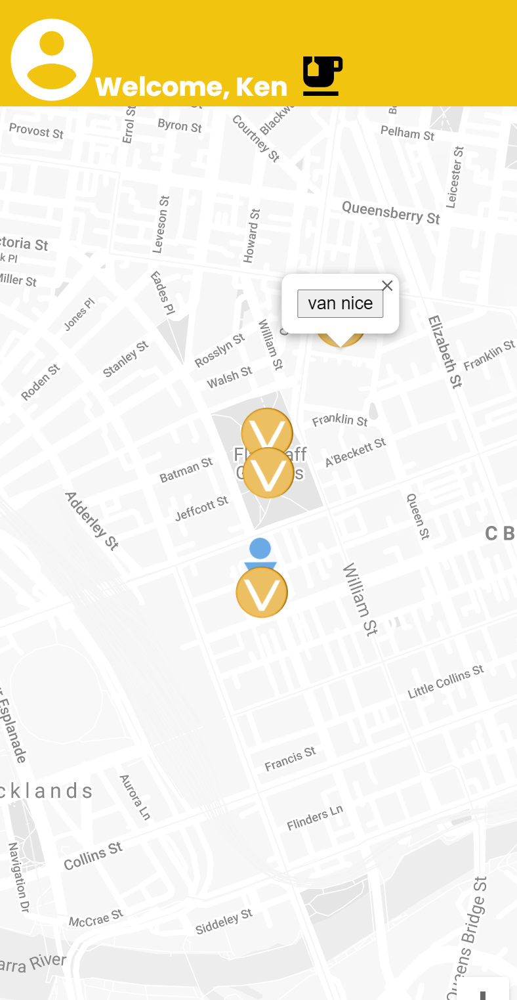
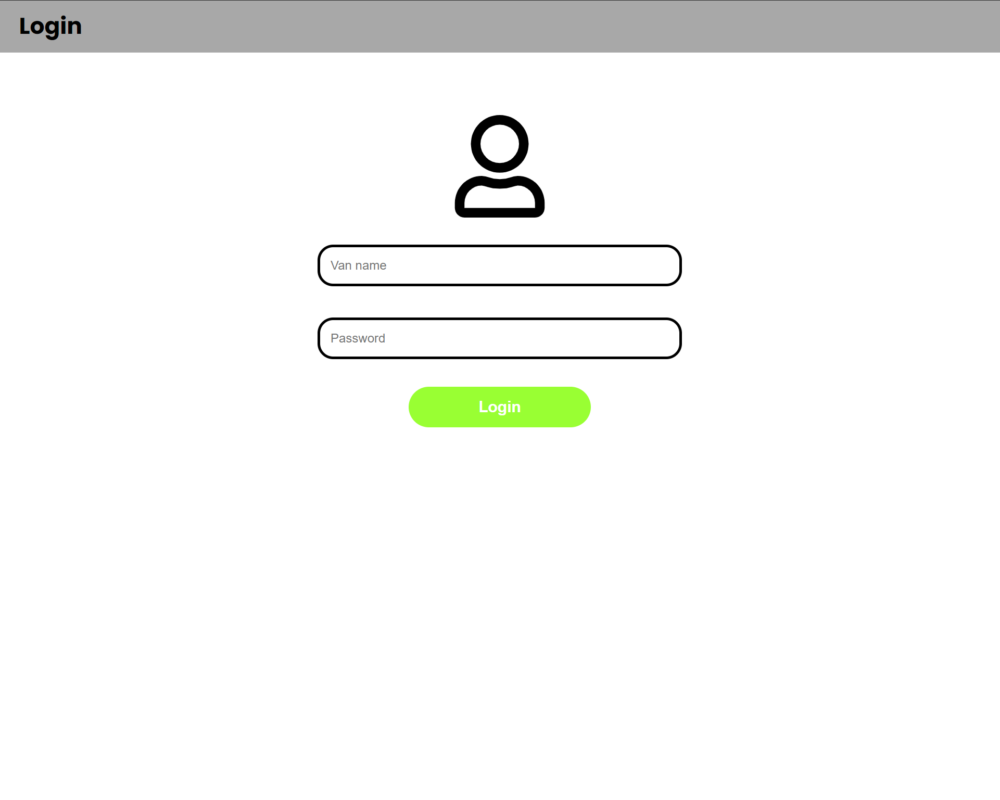

The University of Melbourne

# INFO30005 – Web Information Technologies

# Group Project by Team Starfleet - Deliverable 3

## Team Members

| Name         |  Task  |   State |
| :----------- | :----: | ------: |
| Henry Mcgee  | Task 1 | Working |
| Andy Tran    | Task 2 | Working |
| Chengkai Yao | Task 3 | Working |
| Marvin Chew  | Task 4 | Working |
| Yifei Wang   | Task 5 | working |

# DB ACCESS INFO && Heroku Link

MONGODB ACCESS STRING: "mongodb+srv://<username>:<password>@cluster0.dbsqz.mongodb.net/INFO30005?retryWrites=true&w=majority"

username=Henry

password=Chook1567!

frontend: https://info30005starfleet-frontend.herokuapp.com/
>

backend: https://info30005starfleet.herokuapp.com/
>
# Home page
>this allow you to choose which app you want to test

# Customer App
#### Homepage
> this allow you to choose which app you want to test

#### Login & Signup Pages
The login and signup pages can be found on the paths "/login" and "/signup"
respectively. To test the login there is dummy user info below. Alternatively
you may signup your own user for testing.

Dummy user:
email: "chengkai@student.unimelb.edu.au"
  
password: "password9"

#### List of orders and Order Details Page

By clicking the CustomerOrders, you can see the list of order History.
By clicking the Details, you can see the details of each order.(Order Details may only be kept for the outstanding orders including the function of changing the order)
The customer id is fixed at this stage to test the functions, After the login and registration is done, id will be extracted from that.

This should only work if a user is logged in.(login verification required)

# Vendor App
#### Log in && Start Selling
>Vendor should sign up to start use app. They can choose to start slling later by typing their location description, the app will automatically get their current location

>avilible van:
  
>van_name: van AAA
>password: password
